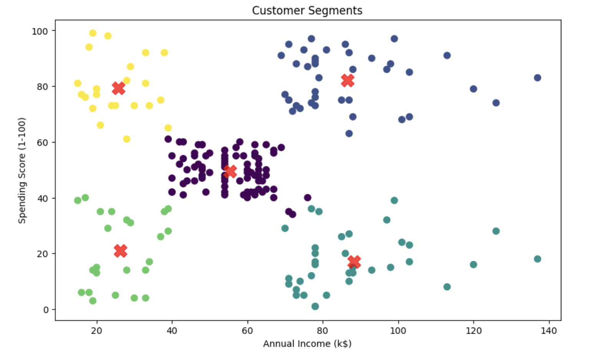
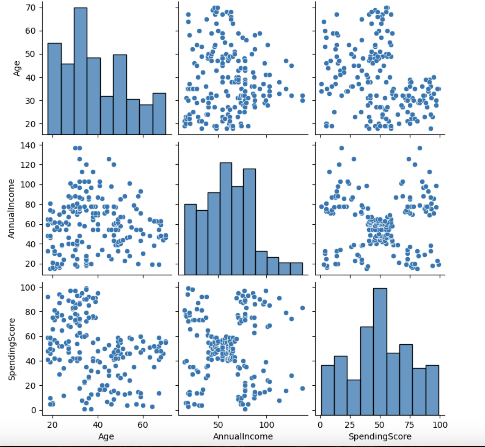
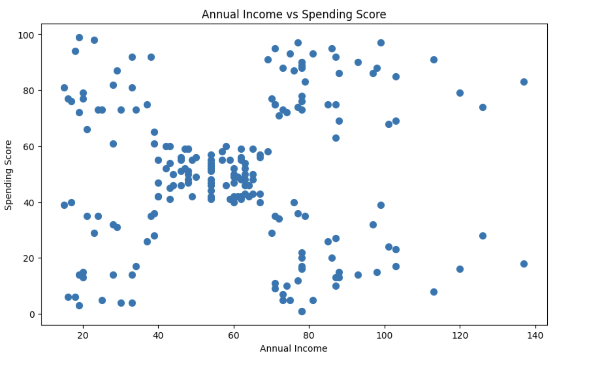
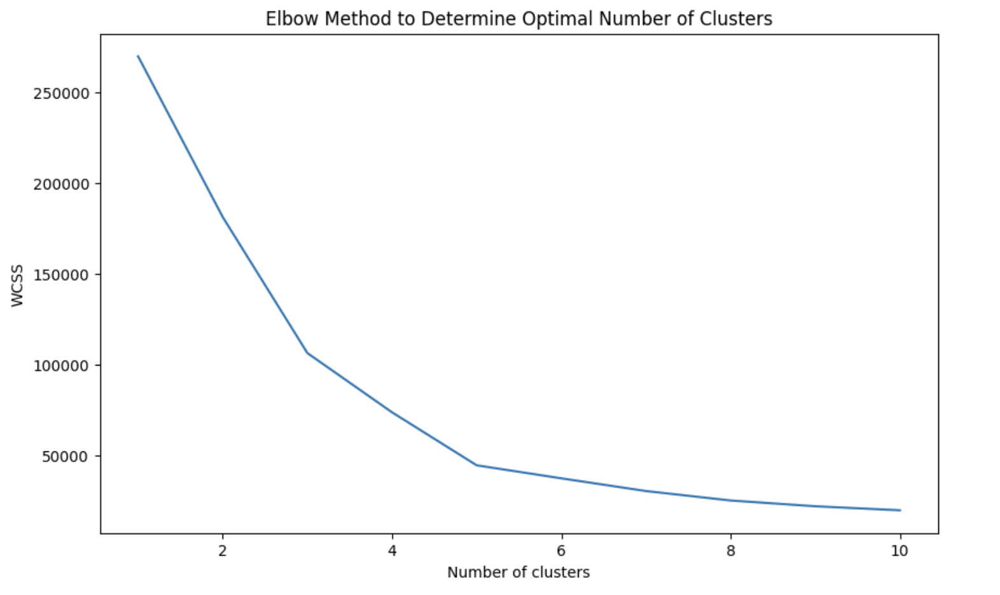

# Mall Customer Segmentation Using K-Means Clustering

> An end-to-end machine learning project using Python and K-Means clustering to identify distinct customer segments and generate actionable business recommendations.



---

# Business Problem

Imagine you are working as a data analyst for a shopping mall.

The marketing team wants to better understand its customers so they can answer questions like:

- Which customers are our most valuable?
- Who should receive loyalty rewards?
- Which customers are likely to respond to premium promotions?
- Which customers require different marketing strategies?

Instead of treating every customer the same, customer segmentation groups people with similar characteristics together. This allows businesses to create targeted marketing campaigns, improve customer retention, and allocate marketing budgets more effectively.

In this project, I use **K-Means clustering** to identify meaningful customer groups based on their annual income and spending behaviour.

---

# Dataset

**Source:** https://www.kaggle.com/datasets/vjchoudhary7/customer-segmentation-tutorial-in-python

The dataset contains information about **200 mall customers**.

| Column | Description |
|---------|-------------|
| CustomerID | Unique customer identifier |
| Gender | Male or Female |
| Age | Customer age |
| Annual Income (k$) | Annual income in thousands of dollars |
| Spending Score (1–100) | Score assigned by the mall based on customer spending behaviour |

The project primarily focuses on **Annual Income** and **Spending Score**, as these variables provide the clearest representation of purchasing behaviour.

---

# Project Workflow

```text
Load Dataset
      ↓
Explore the Data
      ↓
Data Cleaning & Preparation
      ↓
Exploratory Data Analysis
      ↓
Feature Selection
      ↓
Determine Optimal Number of Clusters
      ↓
Train K-Means Model
      ↓
Visualise Customer Segments
      ↓
Generate Business Recommendations
```

---

# Exploratory Data Analysis

Before building the clustering model, I explored the dataset to better understand customer characteristics.

The analysis included:

- Checking for missing values
- Reviewing data types
- Generating descriptive statistics
- Renaming columns for readability
- Exploring relationships between variables
- Creating visualisations to identify potential patterns

## Pairplot

The pairplot provides an overview of the relationships between customer age, annual income, and spending score.



The visualisation suggests that annual income and spending score are the most suitable variables for segmentation.

---

## Income vs Spending Score

Plotting annual income against spending score reveals several naturally occurring customer groups.



Although the clusters are not perfectly separated, clear patterns begin to emerge, making K-Means clustering an appropriate technique.

---

# Determining the Number of Clusters

One of the most important decisions in K-Means clustering is selecting the optimal number of clusters.

To determine this value, I used the **Elbow Method**, which calculates the Within-Cluster Sum of Squares (WCSS) for different numbers of clusters.



The curve begins to flatten at **k = 5**, indicating that five clusters provide a good balance between model complexity and explanatory power.

---

# Building the Model

After selecting the optimal number of clusters, I trained a K-Means model using:

- Annual Income
- Spending Score

The model assigns each customer to one of five clusters while minimising the distance between customers within the same group.

---

# Results

The clustering algorithm identified five distinct customer segments.


| Cluster | Interpretation |
|----------|----------------|
| Cluster 1 | Low Income • Low Spending |
| Cluster 2 | Low Income • High Spending |
| Cluster 3 | Moderate Income • Moderate Spending |
| Cluster 4 | High Income • Low Spending |
| Cluster 5 | High Income • High Spending |

---

# Business Insights

## High Income • High Spending

These customers represent the mall's premium customer base.

**Potential actions:**

- VIP loyalty programmes
- Early access to new collections
- Premium product recommendations

---

## High Income • Low Spending

These customers have purchasing power but currently spend relatively little.

**Potential actions:**

- Personalised promotions
- Exclusive discounts
- Customer surveys to understand purchasing barriers

---

## Moderate Income • Moderate Spending

These customers form the core customer base.

**Potential actions:**

- Seasonal promotions
- Cross-selling opportunities
- Loyalty rewards

---

## Low Income • High Spending

Although these customers have lower incomes, they spend actively.

**Potential actions:**

- Value bundles
- Rewards programmes
- Cashback promotions

---

## Low Income • Low Spending

These customers are generally budget-conscious.

**Potential actions:**

- Entry-level promotions
- Price-sensitive campaigns
- Basic loyalty incentives

---

# Technologies Used

- Python
- Pandas
- NumPy
- Matplotlib
- Seaborn
- Scikit-learn
- Jupyter Notebook

---

# Repository Structure

```text
mall-customer-segmentation/
│
├── data/
│   └── Mall_Customers.csv
│
├── images/
│   ├── elbow_method.png
│   ├── income_spending_clusters.png
│   ├── income_spending_scatter.png
│   └── pairplot.png
│
├── notebooks/
│   └── mall_customer_segmentation.ipynb
│
├── src/
│   └── customer_segmentation.py
│
├── requirements.txt
└── README.md
```

---

# How to Run the Project

Clone the repository:

```bash
git clone https://github.com/yourusername/mall-customer-segmentation.git
```

Install the required packages:

```bash
pip install -r requirements.txt
```

Run the notebook:

```bash
jupyter notebook
```

or execute the Python script:

```bash
python src/customer_segmentation.py
```

---

# Future Improvements

Possible extensions include:

- Feature scaling comparison
- Silhouette Score evaluation
- Comparing K-Means with DBSCAN and Hierarchical Clustering
- Including additional customer features
- Building an interactive Streamlit dashboard
- Deploying the project as a web application

---

# Key Takeaways

Using only **Annual Income** and **Spending Score**, K-Means clustering successfully identified five meaningful customer groups.

These customer segments can support:

- More targeted marketing campaigns
- Improved customer retention
- Better allocation of advertising budgets
- Personalised promotional strategies

This project demonstrates a complete machine learning workflow, from exploratory data analysis through model development to business interpretation, highlighting how unsupervised learning can generate actionable business insights.
